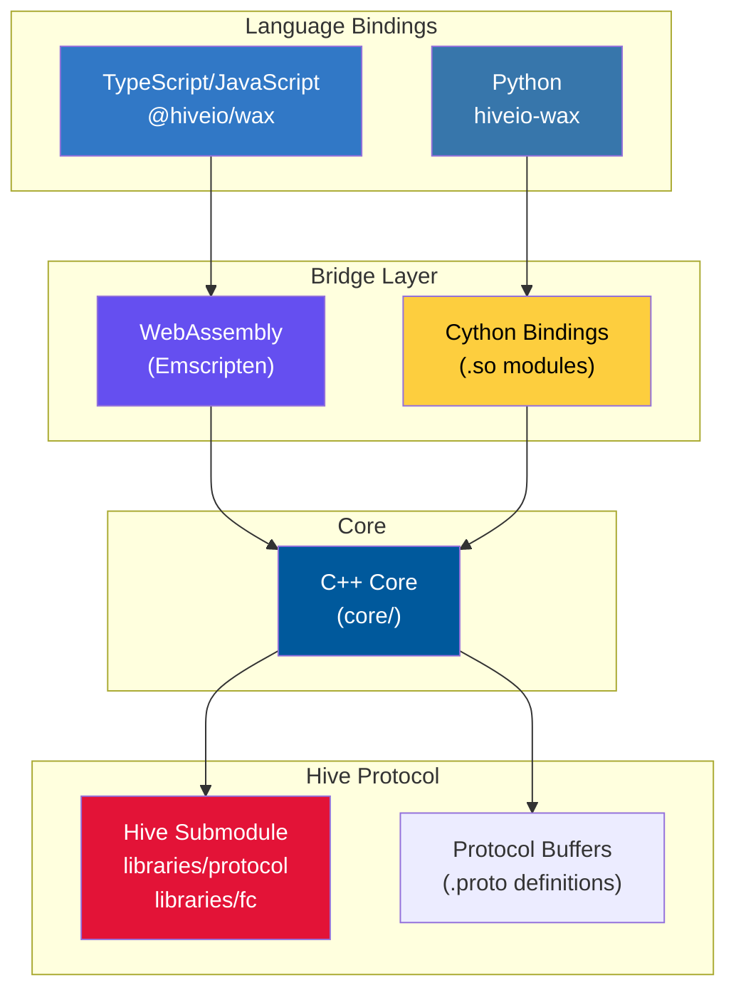

## Dual-language design

WAX provides Hive blockchain protocol features to both Python and TypeScript/JavaScript through a shared C++ core. This architecture allows you to work with the same blockchain functionality in your preferred language while maintaining consistency and performance.



## Language bindings

### TypeScript/JavaScript

The TypeScript implementation uses WebAssembly (WASM) compiled from C++ via Emscripten:

- **Package**: `@hiveio/wax` published to npm
- **Location**: `ts/wasm/lib/` in the source tree
- **Build target**: WASM artifacts in `ts/wasm/build_wasm/`
- **Design principle**: Minimal bundle size for web applications

```typescript
import { createWaxFoundation, createHiveChain } from "@hiveio/wax";

// Offline operations (transaction building, signing, validation)
const wax = await createWaxFoundation();

// Online operations (API calls, broadcasting)
const chain = await createHiveChain();
```

### Python

The Python implementation uses Cython bindings compiled to native `.so` modules:

- **Package**: `hiveio-wax` published to PyPI
- **Location**: `python/wax/` in the source tree
- **Bridge**: `cpp_python_bridge.pyx` provides Cython bindings
- **Requirements**: Python 3.14+

```python
from wax import create_wax_foundation, create_hive_chain

# Offline operations
wax = create_wax_foundation()

# Online operations
chain = create_hive_chain()
```

## C++ core

The `core/` subdirectory contains the common C++ implementation shared by both language bindings:

### Key components

<CodeGroup>
```cpp foundation.hpp
class foundation {
public:
  std::string cpp_calculate_public_key(const std::string& wif);
  std::string cpp_generate_private_key();
  private_key_data cpp_generate_private_key(
    const std::string& account,
    const std::string& role,
    const std::string& password
  );
  // Transaction operations
  // Signing operations
  // Validation operations
};
```

```cpp types.hpp
using hive_tx = hive::protocol::signed_transaction;
using hive_op = hive::protocol::operation;

class hive_transaction_handle {
public:
  hive_tx& get() const { return *tx; }
  std::unique_ptr<hive_tx, wax_tx_ptr_deleter> tx;
};
```
</CodeGroup>

### Core files

| File | Purpose |
|------|--------|
| `foundation.cpp/hpp` | Core transaction and cryptographic operations |
| `api_converter.hpp` | Converts between API JSON and protocol buffers |
| `proto_converter.hpp` | Protocol buffer conversion utilities |
| `signing_keys_collector.cpp/hpp` | Extracts required signing keys from transactions |
| `binary_view_helper.cpp/hpp` | Binary serialization metadata |
| `operations_fwd.hpp` | Forward declarations for all operations |
| `val_protocol.hpp` | Validation rules for protocol operations |

## Protocol buffers

WAX uses Protocol Buffers (protobuf) as the canonical format for representing blockchain operations and types. These definitions come from the Hive blockchain source in the `hive/` submodule:

**Source location**: `hive/libraries/protocol/proto/`

### Generation process

<Steps>
  <Step title="TypeScript generation">
    Protocol buffers are compiled to TypeScript using `ts-proto`:
    
    ```bash
    # Output location
    ts/wasm/lib/proto/
    
    # Pattern tracking
    ts/protobuf_patterns/
    ```
  </Step>
  
  <Step title="Python generation">
    Protocol buffers are compiled to Python using `grpcio-tools`:
    
    ```bash
    # Output location
    python/wax/_private/proto/
    
    # Pattern tracking
    python/protobuf_patterns/
    ```
  </Step>
</Steps>

### Example operation definitions

<CodeGroup>
```typescript transfer.ts
export interface transfer {
  from: string;
  to: string;
  amount: asset | undefined;
  memo: string;
}
```

```python transfer.py
from wax.proto.operations import transfer

op = transfer(
    from_account="alice",
    to_account="bob",
    amount=wax.hive(1),
    memo="Hello!"
)
```
</CodeGroup>

## Entry points

Both language implementations provide two main entry points that separate offline and online functionality:

### Offline operations (Foundation)

<Tabs>
  <Tab title="TypeScript">
    ```typescript
    import { createWaxFoundation } from "@hiveio/wax";
    
    const wax = await createWaxFoundation();
    
    // Available operations:
    // - Transaction building
    // - Transaction signing
    // - Transaction validation
    // - Cryptographic operations
    // - No network calls
    ```
  </Tab>
  
  <Tab title="Python">
    ```python
    from wax import create_wax_foundation
    
    wax = create_wax_foundation()
    
    # Available operations:
    # - Transaction building
    # - Transaction signing
    # - Transaction validation
    # - Cryptographic operations
    # - No network calls
    ```
  </Tab>
</Tabs>

**Implementation**:
- TypeScript: `ts/wasm/lib/detailed/base.ts`
- Python: `python/wax/wax_factory.py`

### Online operations (Chain)

<Tabs>
  <Tab title="TypeScript">
    ```typescript
    import { createHiveChain } from "@hiveio/wax";
    
    const chain = await createHiveChain({
      apiEndpoint: "https://api.hive.blog",
      restApiEndpoint: "https://api.syncad.com"
    });
    
    // Includes all Foundation operations plus:
    // - API calls to Hive nodes
    // - Transaction broadcasting
    // - Account queries
    // - Block retrieval
    ```
  </Tab>
  
  <Tab title="Python">
    ```python
    from wax import create_hive_chain, WaxChainOptions
    
    chain = create_hive_chain(
        WaxChainOptions(endpoint_url="https://api.hive.blog")
    )
    
    # Includes all Foundation operations plus:
    # - API calls to Hive nodes
    # - Transaction broadcasting
    # - Account queries
    # - Block retrieval
    ```
  </Tab>
</Tabs>

**Implementation**:
- TypeScript: `ts/wasm/lib/detailed/chain.ts`
- Python: `python/wax/_private/chain_api.py`

## Project structure

The repository is organized to maintain separation between language implementations while sharing the core:

```
wax/
├── core/                    # Shared C++ implementation
│   ├── foundation.cpp/hpp   # Core operations
│   ├── api_converter.hpp    # JSON ↔ Proto conversion
│   └── signing_keys_collector.cpp/hpp
│
├── hive/                    # Git submodule (Hive blockchain)
│   └── libraries/protocol/proto/  # Protocol definitions
│
├── ts/                      # TypeScript implementation
│   ├── wasm/lib/detailed/   # Core implementation
│   │   ├── base.ts          # createWaxFoundation()
│   │   ├── chain.ts         # createHiveChain()
│   │   ├── transaction.ts   # Transaction class
│   │   └── api/             # API type definitions
│   └── packages/            # Extension packages (signers)
│
└── python/                  # Python implementation
    └── wax/
        ├── wax_factory.py           # Entry points
        ├── cpp_python_bridge.pyx    # Cython bindings
        └── _private/
            ├── transaction.py       # Transaction class
            └── api/                 # API implementation
```

## Build process

### TypeScript

<Steps>
  <Step title="Compile protobuf definitions">
    ```bash
    # Generate TypeScript types from .proto files
    ts-proto → ts/wasm/lib/proto/
    ```
  </Step>
  
  <Step title="Compile C++ to WASM">
    ```bash
    # Use Emscripten to compile C++ core
    emcc → ts/wasm/build_wasm/
    ```
  </Step>
  
  <Step title="Build TypeScript">
    ```bash
    pnpm run build
    # Compiles TS and bundles with WASM
    ```
  </Step>
</Steps>

### Python

<Steps>
  <Step title="Compile protobuf definitions">
    ```bash
    # Generate Python types from .proto files
    grpcio-tools → python/wax/_private/proto/
    ```
  </Step>
  
  <Step title="Compile Cython bindings">
    ```bash
    # Build native extension modules
    cython → .so files
    ```
  </Step>
  
  <Step title="Build wheel">
    ```bash
    ./python/wax/scripts/build_wax.sh
    # Creates distributable wheel
    ```
  </Step>
</Steps>

## Performance characteristics

<CardGroup cols={2}>
  <Card title="TypeScript/WASM" icon="javascript">
    - Near-native performance in browsers
    - Small bundle size (optimized for web)
    - Instant startup
    - Memory-efficient
  </Card>
  
  <Card title="Python/Cython" icon="python">
    - Native C++ performance
    - Direct memory access
    - Minimal overhead
    - Ideal for server applications
  </Card>
</CardGroup>

## Next steps

<CardGroup cols={2}>
  <Card title="Transactions" icon="file-invoice" href="/concepts/transactions">
    Learn how transactions work in WAX
  </Card>
  
  <Card title="Operations" icon="code" href="/concepts/operations">
    Understand operations and protocol buffers
  </Card>
  
  <Card title="Signing" icon="signature" href="/concepts/signing">
    Explore transaction signing and wallets
  </Card>
  
  <Card title="Quickstart" icon="rocket" href="/quickstart">
    Build your first application
  </Card>
</CardGroup>
