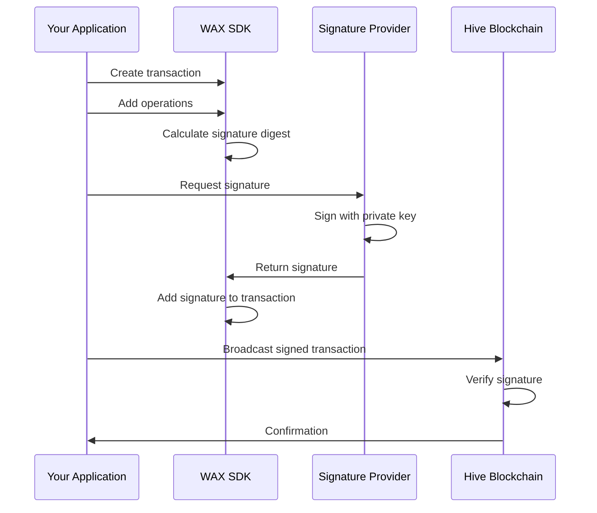

## Why transactions need signatures

Every transaction on the Hive blockchain must be cryptographically signed to prove that it's authorized by the account(s) performing the operations. Signatures ensure:

<CardGroup cols={2}>
  <Card title="Authentication" icon="user-check">
    Proves the transaction creator has access to the private keys
  </Card>
  
  <Card title="Authorization" icon="lock">
    Verifies the account holder approves the operations
  </Card>
  
  <Card title="Integrity" icon="shield">
    Ensures the transaction hasn't been modified after signing
  </Card>
  
  <Card title="Non-repudiation" icon="stamp">
    Creates an immutable proof of the transaction's origin
  </Card>
</CardGroup>

## How signing works



### Signature digest

Before signing, WAX calculates a signature digest (hash) of the transaction:

<Tabs>
  <Tab title="TypeScript">
    ```typescript
    const digest = tx.sigDigest;
    // Returns: "a1b2c3d4e5f6789..."
    
    // The digest includes:
    // - Chain ID
    // - Transaction data (operations, expiration, TAPOS)
    // - HF26 serialization format
    ```
  </Tab>
  
  <Tab title="Python">
    ```python
    digest = tx.sig_digest
    # Returns: "a1b2c3d4e5f6789..."
    
    # The digest includes:
    # - Chain ID
    # - Transaction data (operations, expiration, TAPOS)
    # - HF26 serialization format
    ```
  </Tab>
</Tabs>

<Info>
  The signature digest is deterministic - the same transaction always produces the same digest, making signatures verifiable.
</Info>

## Signature providers

WAX supports multiple signature providers through a pluggable interface. You choose the provider based on your application's needs:

### Available providers

<CardGroup cols={2}>
  <Card title="Beekeeper" icon="bee" href="/typescript/signers/beekeeper">
    Server-side wallet manager for automated signing
  </Card>
  
  <Card title="Hive Keychain" icon="key" href="/typescript/signers/keychain">
    Browser extension for secure key management
  </Card>
  
  <Card title="PeakVault" icon="vault" href="/typescript/signers/peakvault">
    Mobile-friendly wallet integration
  </Card>
  
  <Card title="MetaMask" icon="wallet" href="/typescript/signers/metamask">
    Ethereum wallet adapter for Hive
  </Card>
</CardGroup>

### Provider interface

All signature providers implement a common interface:

<Tabs>
  <Tab title="TypeScript">
    ```typescript ts/wasm/lib/detailed/extensions/signatures/index.ts
    export interface IOnlineSignatureProvider {
      /**
       * Signs a transaction by signing a digest of the transaction
       *
       * @param transaction - Transaction to be signed
       * @returns Promise that resolves when signing is complete
       */
      signTransaction(transaction: ITransaction): Promise<void>;
    }
    
    // Legacy interface (deprecated)
    export interface ISignatureProvider {
      signDigest(publicKey: TPublicKey, sigDigest: THexString): TSignature;
      encryptData(content: string, key: TPublicKey, anotherKey?: TPublicKey, nonce?: number): string;
      decryptData(content: string, key: TPublicKey, anotherKey?: TPublicKey): string;
    }
    ```
  </Tab>
  
  <Tab title="Python">
    ```python
    from beekeepy import AsyncUnlockedWallet
    
    # Python uses Beekeeper's wallet interface
    class AsyncUnlockedWallet:
        async def sign_digest(
            self,
            sig_digest: str,
            key: str
        ) -> str:
            """Signs a digest with the specified key"""
            ...
    ```
  </Tab>
</Tabs>

## Signing with Beekeeper

Beekeeper is the recommended signature provider for server-side applications and automation:

<Tabs>
  <Tab title="TypeScript">
    ```typescript
    import { createHiveChain } from "@hiveio/wax";
    import BeekeeperProvider from "@hiveio/wax-signers-beekeeper";
    import { Beekeeper } from "@hiveio/beekeeper";
    
    // Initialize Beekeeper
    const beekeeper = await Beekeeper.factory();
    const session = await beekeeper.createSession("my-app");
    const wallet = await session.createWallet("my-wallet");
    
    // Import key
    await wallet.importKey("5JPrivateKeyHere...");
    
    // Create transaction
    const chain = await createHiveChain();
    const tx = await chain.createTransaction();
    
    tx.pushOperation({
      vote_operation: {
        voter: "alice",
        author: "bob",
        permlink: "example-post",
        weight: 10000
      }
    });
    
    // Sign transaction
    const provider = await BeekeeperProvider.for(
      chain,
      wallet,
      "alice",
      "posting"
    );
    
    await provider.signTransaction(tx);
    
    // Broadcast
    await chain.broadcast(tx);
    ```
  </Tab>
  
  <Tab title="Python">
    ```python examples/python/examples/create_and_sign_transation.py
    from beekeepy import AsyncBeekeeper
    from wax import create_hive_chain, WaxChainOptions
    from wax.proto.operations import transfer
    
    # Initialize Beekeeper
    async with await AsyncBeekeeper.factory() as beekeeper:
        session = await beekeeper.create_session(salt="")
        wallet = await session.create_wallet(
            name="my-wallet",
            password="password"
        )
        
        # Import key
        await wallet.import_key(private_key="5JPrivateKeyHere...")
        
        # Create transaction
        chain = create_hive_chain(
            WaxChainOptions(endpoint_url="https://api.hive.blog")
        )
        
        tx = await chain.create_transaction()
        tx.push_operation(
            transfer(
                from_account="alice",
                to_account="bob",
                amount=chain.hive(1),
                memo="Payment"
            )
        )
        
        # Sign transaction
        public_key = "STM6vJmr..."
        await tx.sign(wallet=wallet, public_key=public_key)
        
        # Broadcast
        await chain.broadcast(tx)
    ```
  </Tab>
</Tabs>

## Signing with browser extensions

For web applications, browser extensions like Hive Keychain provide secure signing without exposing private keys:

<Tabs>
  <Tab title="Keychain">
    ```typescript
    import { createHiveChain } from "@hiveio/wax";
    import KeychainProvider from "@hiveio/wax-signers-keychain";
    
    const chain = await createHiveChain();
    const tx = await chain.createTransaction();
    
    tx.pushOperation({
      vote_operation: {
        voter: "alice",
        author: "bob",
        permlink: "example-post",
        weight: 10000
      }
    });
    
    // Sign with Keychain
    const provider = KeychainProvider.for("alice", "posting");
    await provider.signTransaction(tx);
    
    // Broadcast
    await chain.broadcast(tx);
    ```
  </Tab>
  
  <Tab title="PeakVault">
    ```typescript
    import { createHiveChain } from "@hiveio/wax";
    import PeakVaultProvider from "@hiveio/wax-signers-peakvault";
    
    const chain = await createHiveChain();
    const tx = await chain.createTransaction();
    
    tx.pushOperation({
      transfer_operation: {
        from: "alice",
        to: "bob",
        amount: chain.hive(10),
        memo: "Payment"
      }
    });
    
    // Sign with PeakVault
    const provider = await PeakVaultProvider.for("alice", "active");
    await provider.signTransaction(tx);
    
    // Broadcast
    await chain.broadcast(tx);
    ```
  </Tab>
</Tabs>

<Note>
  Browser extension providers handle user interaction (prompts, confirmations) automatically.
</Note>

## Authority levels

Hive accounts have multiple authority levels, each with different permissions:

<AccordionGroup>
  <Accordion title="Posting authority">
    Used for social interactions:
    - Voting on content
    - Creating posts and comments
    - Following/unfollowing
    - Custom JSON operations (most apps)
    
    **Lowest security level** - Safe to use with third-party apps
  </Accordion>
  
  <Accordion title="Active authority">
    Used for financial operations:
    - Transfers
    - Market orders
    - Power ups/downs
    - Account updates
    
    **Medium security level** - Use with trusted apps only
  </Accordion>
  
  <Accordion title="Owner authority">
    Used for account recovery:
    - Changing owner key
    - Account recovery
    - Changing other authorities
    
    **Highest security level** - Keep offline, use rarely
  </Accordion>
  
  <Accordion title="Memo authority">
    Used for encrypting memos:
    - Encrypting transfer memos
    - Private messages
    
    **Special purpose** - Separate key for privacy
  </Accordion>
</AccordionGroup>

### Required authorities

You can check which authorities a transaction requires:

<Tabs>
  <Tab title="TypeScript">
    ```typescript
    const authorities = tx.requiredAuthorities;
    
    console.log("Posting:", Array.from(authorities.posting));
    // ["alice"]
    
    console.log("Active:", Array.from(authorities.active));
    // []
    
    console.log("Owner:", Array.from(authorities.owner));
    // []
    ```
  </Tab>
  
  <Tab title="Python">
    ```python
    authorities = tx.required_authorities
    
    print(f"Posting: {authorities.posting}")
    # ["alice"]
    
    print(f"Active: {authorities.active}")
    # []
    
    print(f"Owner: {authorities.owner}")
    # []
    ```
  </Tab>
</Tabs>

## Multiple signatures

Some operations require signatures from multiple accounts or multiple keys from the same account:

<Tabs>
  <Tab title="TypeScript">
    ```typescript
    // Multi-signature transaction
    const tx = await chain.createTransaction();
    
    // Escrow operation requires both parties
    tx.pushOperation({
      escrow_release_operation: {
        from: "alice",
        to: "bob",
        agent: "escrow-agent",
        who: "alice",
        receiver: "bob",
        escrow_id: 12345,
        hbd_amount: chain.hbd(100),
        hive_amount: chain.hive(0)
      }
    });
    
    // Sign with first account
    const provider1 = await BeekeeperProvider.for(
      chain,
      wallet1,
      "alice",
      "active"
    );
    await provider1.signTransaction(tx);
    
    // Sign with second account
    const provider2 = await BeekeeperProvider.for(
      chain,
      wallet2,
      "escrow-agent",
      "active"
    );
    await provider2.signTransaction(tx);
    
    console.log("Signatures:", tx.transaction.signatures.length);
    // 2
    ```
  </Tab>
  
  <Tab title="Python">
    ```python
    # Multi-signature transaction
    tx = await chain.create_transaction()
    
    # Escrow operation requires both parties
    from wax.proto.operations import escrow_release
    
    tx.push_operation(
        escrow_release(
            from_account="alice",
            to="bob",
            agent="escrow-agent",
            who="alice",
            receiver="bob",
            escrow_id=12345,
            hbd_amount=chain.hbd(100),
            hive_amount=chain.hive(0)
        )
    )
    
    # Sign with first account
    await tx.sign(wallet=wallet1, public_key="STM6...")
    
    # Sign with second account
    await tx.sign(wallet=wallet2, public_key="STM5...")
    
    print(f"Signatures: {len(tx.transaction.signatures)}")
    # 2
    ```
  </Tab>
</Tabs>

## Manual signature handling

For advanced use cases, you can manage signatures manually:

<Tabs>
  <Tab title="TypeScript">
    ```typescript
    // Get signature digest
    const digest = tx.sigDigest;
    
    // Sign externally (e.g., hardware wallet)
    const signature = await externalSigner.sign(digest);
    
    // Add signature to transaction
    tx.addSignature(signature);
    
    // Check if transaction is signed
    if (tx.isSigned()) {
      await chain.broadcast(tx);
    }
    ```
  </Tab>
  
  <Tab title="Python">
    ```python
    # Get signature digest
    digest = tx.sig_digest
    
    # Sign externally (e.g., hardware wallet)
    signature = await external_signer.sign(digest)
    
    # Add signature to transaction
    tx.add_signature(signature)
    
    # Check if transaction is signed
    if tx.is_signed:
        await chain.broadcast(tx)
    ```
  </Tab>
</Tabs>

## Signature verification

You can verify that a transaction's signatures are valid:

<Tabs>
  <Tab title="TypeScript">
    ```typescript
    // Get public keys that signed the transaction
    const signerKeys = tx.signatureKeys;
    // Returns: ["STM6vJmrwaX5...", "STM5VJ9YJH7r..."]
    
    // Verify signature matches expected key
    const expectedKey = "STM6vJmrwaX5TjgTS9dPH8KsArso5m91fVodJvv91j7G765wqcNM9";
    if (signerKeys.includes(expectedKey)) {
      console.log("Signature verified!");
    }
    ```
  </Tab>
  
  <Tab title="Python">
    ```python
    # Get public keys that signed the transaction
    signer_keys = tx.signature_keys
    # Returns: ["STM6vJmrwaX5...", "STM5VJ9YJH7r..."]
    
    # Verify signature matches expected key
    expected_key = "STM6vJmrwaX5TjgTS9dPH8KsArso5m91fVodJvv91j7G765wqcNM9"
    if expected_key in signer_keys:
        print("Signature verified!")
    ```
  </Tab>
</Tabs>

## Encryption and decryption

Signature providers also handle encryption for private memos:

<Tabs>
  <Tab title="TypeScript">
    ```typescript
    import BeekeeperProvider from "@hiveio/wax-signers-beekeeper";
    
    const provider = await BeekeeperProvider.for(
      chain,
      wallet,
      "alice",
      "posting"
    );
    
    // Encrypt memo
    const encrypted = await provider.encryptData(
      "Secret message",
      "STM6vJmrwaX5TjgTS9dPH8KsArso5m91fVodJvv91j7G765wqcNM9"  // Recipient's memo key
    );
    
    // Transfer with encrypted memo
    tx.pushOperation({
      transfer_operation: {
        from: "alice",
        to: "bob",
        amount: chain.hive(1),
        memo: encrypted  // Starts with #
      }
    });
    
    // Decrypt memo
    const decrypted = await provider.decryptData(encrypted);
    console.log(decrypted);  // "Secret message"
    ```
  </Tab>
  
  <Tab title="Python">
    ```python
    from beekeepy import AsyncUnlockedWallet
    
    # Encrypt memo
    encrypted = await wallet.encrypt_data(
        content="Secret message",
        from_key="STM6...",  # Sender's memo key
        to_key="STM5..."     # Recipient's memo key
    )
    
    # Transfer with encrypted memo
    tx.push_operation(
        transfer(
            from_account="alice",
            to_account="bob",
            amount=chain.hive(1),
            memo=encrypted  # Starts with #
        )
    )
    
    # Decrypt memo
    decrypted = await wallet.decrypt_data(
        encrypted_content=encrypted,
        from_key="STM5...",  # Sender's memo key
        to_key="STM6..."     # Recipient's memo key
    )
    print(decrypted)  # "Secret message"
    ```
  </Tab>
</Tabs>

<Warning>
  Encrypted memos must start with `#` to be recognized as encrypted. WAX handles this automatically when you use encryption.
</Warning>

## Key management

WAX provides utilities for working with cryptographic keys:

### Generate keys

<Tabs>
  <Tab title="TypeScript">
    ```typescript
    // Generate random private key
    const privateKey = wax.generatePrivateKey();
    // Returns: "5JPrivateKeyHere..."
    
    // Calculate public key from private key
    const publicKey = wax.calculatePublicKey(privateKey);
    // Returns: "STM6vJmrwaX5..."
    
    // Generate from account, role, and password
    const keyData = wax.generatePrivateKey(
      "alice",
      "posting",
      "my-secure-password"
    );
    // Returns: { privateKey: "5J...", publicKey: "STM..." }
    ```
  </Tab>
  
  <Tab title="Python">
    ```python
    # Generate random private key
    private_key = wax.generate_private_key()
    # Returns: "5JPrivateKeyHere..."
    
    # Calculate public key from private key
    public_key = wax.calculate_public_key(private_key)
    # Returns: "STM6vJmrwaX5..."
    
    # Generate from account, role, and password
    key_data = wax.generate_private_key(
        account="alice",
        role="posting",
        password="my-secure-password"
    )
    # Returns: PrivateKeyData(
    #   private_key="5J...",
    #   public_key="STM..."
    # )
    ```
  </Tab>
</Tabs>

### Brain keys

<Tabs>
  <Tab title="TypeScript">
    ```typescript
    const brainKey = wax.suggestBrainKey();
    // Returns:
    // {
    //   brainKey: "WORD1 WORD2 WORD3 ...",
    //   privateKey: "5J...",
    //   publicKey: "STM..."
    // }
    ```
  </Tab>
  
  <Tab title="Python">
    ```python
    brain_key = wax.suggest_brain_key()
    # Returns: BrainKeyData(
    #   brain_key="WORD1 WORD2 WORD3 ...",
    #   private_key="5J...",
    #   public_key="STM..."
    # )
    ```
  </Tab>
</Tabs>

## Best practices

<AccordionGroup>
  <Accordion title="Never expose private keys">
    Always use signature providers that keep private keys secure. Never log or transmit private keys.
  </Accordion>
  
  <Accordion title="Use appropriate authority levels">
    Only request the minimum authority level needed for your operations. Use posting authority for social operations.
  </Accordion>
  
  <Accordion title="Validate before signing">
    Always call `tx.validate()` before signing to catch errors early and avoid wasting signatures.
  </Accordion>
  
  <Accordion title="Check required authorities">
    Use `tx.requiredAuthorities` to inform users which keys they need to sign with.
  </Accordion>
  
  <Accordion title="Handle signature failures gracefully">
    Users may reject signing requests. Always handle errors and provide clear feedback.
  </Accordion>
</AccordionGroup>

## Next steps

<CardGroup cols={2}>
  <Card title="Broadcasting" icon="broadcast-tower" href="/guides/broadcasting">
    Learn how to broadcast signed transactions
  </Card>
  
  <Card title="Signature Providers" icon="key" href="/typescript/signers/beekeeper">
    Explore all signature provider options
  </Card>
  
  <Card title="Transactions" icon="file-invoice" href="/concepts/transactions">
    Review transaction concepts
  </Card>
  
  <Card title="Security" icon="shield" href="/guides/security">
    Best practices for secure signing
  </Card>
</CardGroup>
