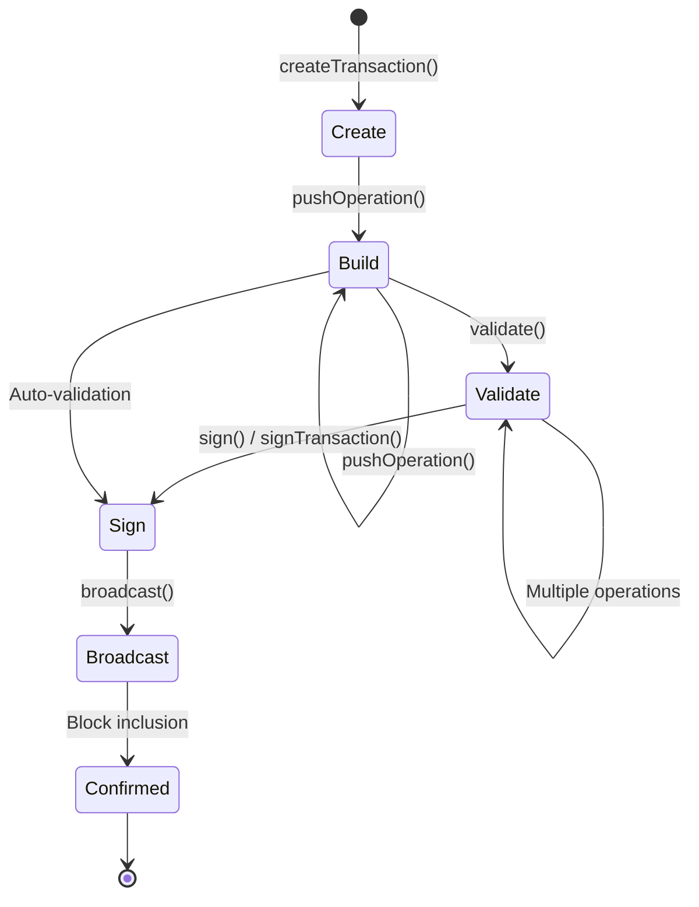

## What is a transaction

A transaction is a signed, atomic unit of work that you submit to the Hive blockchain. Each transaction contains one or more operations that modify the blockchain state.

<Info>
  All operations within a transaction either succeed together or fail together. This ensures data consistency across the blockchain.
</Info>

## Transaction lifecycle



## Creating transactions

You create transactions using the chain instance or foundation instance, depending on whether you need online or offline functionality.

<Tabs>
  <Tab title="TypeScript">
    ```typescript
    import { createHiveChain } from "@hiveio/wax";
    
    const chain = await createHiveChain();
    
    // Online transaction (automatically fetches TAPOS data)
    const tx = await chain.createTransaction();
    
    // Offline transaction (requires manual TAPOS block ID)
    import { createWaxFoundation } from "@hiveio/wax";
    const wax = await createWaxFoundation();
    
    const tx = wax.createTransaction({
      taposBlockId: "0000abcd..."
    });
    ```
  </Tab>
  
  <Tab title="Python">
    ```python
    from wax import create_hive_chain, create_wax_foundation
    
    # Online transaction (automatically fetches TAPOS data)
    chain = create_hive_chain()
    tx = await chain.create_transaction()
    
    # Offline transaction (requires manual TAPOS block ID)
    wax = create_wax_foundation()
    tx = wax.create_transaction(tapos_block_id="0000abcd...")
    ```
  </Tab>
</Tabs>

### Transaction options

You can customize transaction creation with several options:

<ParamField path="taposBlockId" type="string">
  Block ID for TAPOS (Transaction as Proof of Stake) reference
</ParamField>

<ParamField path="expirationTime" type="string | timedelta" default="+1m">
  When the transaction expires (e.g., `"+1m"`, `"+5m"`, `"+1h"`)
</ParamField>

<ParamField path="chainId" type="string" default="mainnet">
  Chain ID for the target blockchain (mainnet, testnet, etc.)
</ParamField>

<ParamField path="headBlockTime" type="Date | HiveDateTime">
  Reference time for expiration calculation (useful for testnets)
</ParamField>

## TAPOS (Transaction as Proof of Stake)

TAPOS ensures your transaction references a recent block, preventing replay attacks across different blockchain forks.

### How TAPOS works

Every transaction includes:

- `ref_block_num`: Lower 16 bits of the referenced block number
- `ref_block_prefix`: First 32 bits of the referenced block ID

These values are automatically calculated from the block ID:

<Tabs>
  <Tab title="TypeScript">
    ```typescript ts/wasm/lib/detailed/transaction.ts
    private taposRefer(hex: TBlockHash): {
      ref_block_num: number;
      ref_block_prefix: number
    } {
      return this.api.wasmManager.safeWasmCall(() =>
        this.api.protocol.cpp_get_tapos_data(hex)
      );
    }
    ```
  </Tab>
  
  <Tab title="Python">
    ```python python/wax/_private/transaction.py
    from wax._private.cython_wrappers import get_tapos_data
    
    tapos = get_tapos_data(tapos_block_id)
    # Returns: python_ref_block_data(
    #   ref_block_num=...,
    #   ref_block_prefix=...
    # )
    ```
  </Tab>
</Tabs>

## Building transactions

You build transactions by adding operations using the `pushOperation()` method:

<Tabs>
  <Tab title="TypeScript">
    ```typescript
    import { createHiveChain } from "@hiveio/wax";
    
    const chain = await createHiveChain();
    const tx = await chain.createTransaction();
    
    // Add a vote operation
    tx.pushOperation({
      vote_operation: {
        voter: "alice",
        author: "bob",
        permlink: "example-post",
        weight: 10000
      }
    });
    
    // Add a transfer operation
    tx.pushOperation({
      transfer_operation: {
        from: "alice",
        to: "bob",
        amount: chain.hive(1),
        memo: "Payment"
      }
    });
    
    // Chain multiple operations
    tx.pushOperation({ /* operation 1 */ })
      .pushOperation({ /* operation 2 */ })
      .pushOperation({ /* operation 3 */ });
    ```
  </Tab>
  
  <Tab title="Python">
    ```python
    from wax import create_hive_chain
    from wax.proto.operations import vote, transfer
    
    chain = create_hive_chain()
    tx = await chain.create_transaction()
    
    # Add a vote operation
    tx.push_operation(
        vote(
            voter="alice",
            author="bob",
            permlink="example-post",
            weight=10000
        )
    )
    
    # Add a transfer operation
    tx.push_operation(
        transfer(
            from_account="alice",
            to_account="bob",
            amount=chain.hive(1),
            memo="Payment"
        )
    )
    
    # Chain multiple operations
    tx.push_operation(op1).push_operation(op2).push_operation(op3)
    ```
  </Tab>
</Tabs>

### Complex operations

WAX provides high-level operation builders for complex operations:

<Tabs>
  <Tab title="TypeScript">
    ```typescript
    import { CommentBuilder } from "@hiveio/wax";
    
    const comment = new CommentBuilder()
      .withAuthor("alice")
      .withPermlink("my-post")
      .withTitle("Hello Hive")
      .withBody("This is my first post!")
      .withTags(["introduction", "hive"]);
    
    tx.pushOperation(comment);
    ```
  </Tab>
  
  <Tab title="Python">
    ```python
    from wax.complex_operations import CommentBuilder
    
    comment = (
        CommentBuilder()
        .with_author("alice")
        .with_permlink("my-post")
        .with_title("Hello Hive")
        .with_body("This is my first post!")
        .with_tags(["introduction", "hive"])
    )
    
    tx.push_operation(comment)
    ```
  </Tab>
</Tabs>

## Transaction structure

At the protocol level, a transaction has the following structure:

```typescript
interface transaction {
  ref_block_num: number;       // TAPOS reference
  ref_block_prefix: number;    // TAPOS reference
  expiration: string;          // ISO 8601 timestamp
  operations: operation[];     // Array of operations
  extensions: any[];           // Future extensions
  signatures: string[];        // Digital signatures
}
```

### Example transaction

```json
{
  "ref_block_num": 12345,
  "ref_block_prefix": 987654321,
  "expiration": "2026-03-04T12:00:00",
  "operations": [
    {
      "vote_operation": {
        "voter": "alice",
        "author": "bob",
        "permlink": "example-post",
        "weight": 10000
      }
    }
  ],
  "extensions": [],
  "signatures": [
    "1f3a5b..."
  ]
}
```

## Validation

Before signing, you can (and should) validate your transaction:

<Tabs>
  <Tab title="TypeScript">
    ```typescript
    try {
      tx.validate();
      console.log("Transaction is valid!");
    } catch (error) {
      console.error("Validation error:", error.message);
    }
    ```
  </Tab>
  
  <Tab title="Python">
    ```python
    try:
        tx.validate()
        print("Transaction is valid!")
    except Exception as error:
        print(f"Validation error: {error}")
    ```
  </Tab>
</Tabs>

<Note>
  Validation is automatically performed when you sign a transaction, but it's good practice to validate early to catch errors.
</Note>

### What validation checks

The validation process verifies:

- Operation structure matches protocol definitions
- Required fields are present
- Field values are within allowed ranges
- Account names follow Hive naming rules
- Assets have correct format and precision
- Custom JSON is valid

## Transaction properties

Once you build a transaction, you can access various properties:

### Transaction ID

<Tabs>
  <Tab title="TypeScript">
    ```typescript
    const txId = tx.id;
    // Returns: "a1b2c3d4e5f6..."
    
    // For legacy compatibility
    const legacyId = tx.legacy_id;
    ```
  </Tab>
  
  <Tab title="Python">
    ```python
    tx_id = tx.id
    # Returns: "a1b2c3d4e5f6..."
    ```
  </Tab>
</Tabs>

### Signature digest

<Tabs>
  <Tab title="TypeScript">
    ```typescript
    const digest = tx.sigDigest;
    // Used for signing
    ```
  </Tab>
  
  <Tab title="Python">
    ```python
    digest = tx.sig_digest
    # Used for signing
    ```
  </Tab>
</Tabs>

### Impacted accounts

<Tabs>
  <Tab title="TypeScript">
    ```typescript
    const accounts = tx.impactedAccounts;
    // Returns: Set<string> { "alice", "bob" }
    ```
  </Tab>
  
  <Tab title="Python">
    ```python
    accounts = tx.impacted_accounts
    # Returns: ["alice", "bob"]
    ```
  </Tab>
</Tabs>

### Required authorities

<Tabs>
  <Tab title="TypeScript">
    ```typescript
    const authorities = tx.requiredAuthorities;
    // Returns:
    // {
    //   posting: Set<string>,
    //   active: Set<string>,
    //   owner: Set<string>,
    //   other: Array<authority>
    // }
    ```
  </Tab>
  
  <Tab title="Python">
    ```python
    authorities = tx.required_authorities
    # Returns TransactionRequiredAuthorities with:
    # - posting: list[str]
    # - active: list[str]
    # - owner: list[str]
    # - other: list[authority]
    ```
  </Tab>
</Tabs>

## Transaction serialization

You can serialize transactions to different formats:

### JSON API format

<Tabs>
  <Tab title="TypeScript">
    ```typescript
    const json = tx.toApiJson();
    // Returns transaction in API JSON format
    
    const jsonString = tx.toString();
    // Returns stringified JSON
    ```
  </Tab>
  
  <Tab title="Python">
    ```python
    json_str = tx.to_api()
    # Returns JSON string
    
    json_dict = tx.to_dict()
    # Returns dictionary
    ```
  </Tab>
</Tabs>

### Binary format

<Tabs>
  <Tab title="TypeScript">
    ```typescript
    const binary = tx.toBinaryForm();
    // Returns hex string
    
    // Strip signatures (for partial signing)
    const unsignedBinary = tx.toBinaryForm(true);
    ```
  </Tab>
  
  <Tab title="Python">
    ```python
    binary = tx.to_binary_form()
    # Returns hex string
    ```
  </Tab>
</Tabs>

### Legacy format

<Tabs>
  <Tab title="TypeScript">
    ```typescript
    const legacy = tx.toLegacyApi();
    // For compatibility with older APIs
    ```
  </Tab>
  
  <Tab title="Python">
    ```python
    legacy = tx.to_legacy_api()
    # For compatibility with older APIs
    ```
  </Tab>
</Tabs>

## Loading existing transactions

You can load and work with existing transactions:

<Tabs>
  <Tab title="TypeScript">
    ```typescript
    import { Transaction } from "@hiveio/wax";
    
    // From JSON string
    const tx = Transaction.fromApi(wax, jsonString);
    
    // From JSON object
    const tx = Transaction.fromApi(wax, jsonObject);
    
    // From proto transaction
    const tx = new Transaction(wax, {
      protoTransaction: protoTx
    });
    ```
  </Tab>
  
  <Tab title="Python">
    ```python
    from wax._private.transaction import Transaction
    
    # From JSON string or dict
    tx = Transaction.from_api(wax, json_data)
    
    # From proto transaction
    tx = Transaction(wax, proto_tx)
    ```
  </Tab>
</Tabs>

## Expiration handling

Transactions have an expiration time to prevent replay attacks:

### Default expiration

<Tabs>
  <Tab title="TypeScript">
    ```typescript
    // Default: +1 minute from now
    const tx = await chain.createTransaction();
    
    // Custom expiration
    const tx = await chain.createTransaction({
      expirationTime: "+5m"  // 5 minutes
    });
    ```
  </Tab>
  
  <Tab title="Python">
    ```python
    from datetime import timedelta
    
    # Default: +1 minute from now
    tx = await chain.create_transaction()
    
    # Custom expiration
    tx = await chain.create_transaction(
        expiration_time=timedelta(minutes=5)
    )
    ```
  </Tab>
</Tabs>

### Expiration format

The expiration is stored as an ISO 8601 timestamp without milliseconds:

```
2026-03-04T12:34:56
```

<Warning>
  Once a transaction expires, it cannot be broadcast. Make sure to sign and broadcast before expiration.
</Warning>

## Implementation details

The transaction implementation resides in:

- **TypeScript**: `ts/wasm/lib/detailed/transaction.ts:48`
- **Python**: `python/wax/_private/transaction.py:51`
- **C++ Core**: `core/foundation.cpp` (handle management)

### Transaction handle

Internally, both implementations maintain a handle to the C++ transaction object:

<Tabs>
  <Tab title="TypeScript">
    ```typescript ts/wasm/lib/detailed/transaction.ts
    protected txHandle: transaction_handle;
    
    // Created via WASM call
    this.txHandle = api.wasmManager.safeWasmCall(() =>
      api.protocol.cpp_create_transaction_handle(this.target, true)
    );
    ```
  </Tab>
  
  <Tab title="Python">
    ```python python/wax/_private/transaction.py
    self._handle = create_wax_transaction(
        self._target,
        is_protobuf=True
    )
    ```
  </Tab>
</Tabs>

## Next steps

<CardGroup cols={2}>
  <Card title="Operations" icon="code" href="/concepts/operations">
    Learn about operations and protocol buffers
  </Card>
  
  <Card title="Signing" icon="signature" href="/concepts/signing">
    Understand how to sign transactions
  </Card>
  
  <Card title="Broadcasting" icon="broadcast-tower" href="/guides/broadcasting">
    Learn how to broadcast transactions
  </Card>
  
  <Card title="API Reference" icon="book" href="/api-reference">
    Explore the complete API
  </Card>
</CardGroup>
